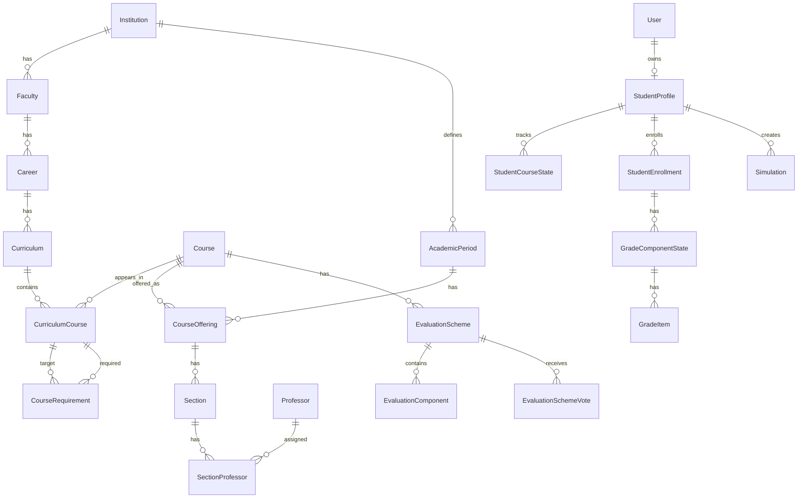

# ERS y especificación completa del sistema EPN Notas Mallas

Documento para análisis, diseño e implementación inicial con un agente de programación.

Versión: 1.0  
Fecha: 2026-06-30  
Alcance inicial: Facultad de Ingeniería de Sistemas de la Escuela Politécnica Nacional  
Estrategia: iniciar con FIS/EPN y dejar el núcleo listo para escalar a toda la EPN

---

## 1. Resumen ejecutivo

El sistema será una aplicación web para estudiantes de la Escuela Politécnica Nacional que permita controlar notas, materias cursadas, avance de malla, requisitos de graduación y simulaciones de matrícula. La primera versión se enfocará en las carreras de la Facultad de Ingeniería de Sistemas, pero el modelo de datos, reglas y arquitectura deben permitir escalar a otras facultades y carreras sin rediseñar el núcleo.

La aplicación tendrá tres modos de uso:

1. **Modo anónimo:** calculadora básica de notas, recuperación/supletorio y simulación simple de materias disponibles sin persistencia.
2. **Modo estudiante registrado:** cuenta validada con correo `@epn.edu.ec`, historial académico manual, materias actuales, control de notas por componente, simulador completo, progreso de malla y requisitos.
3. **Modo administrador:** carga manual de mallas en formato estructurado, gestión de carreras, materias, periodos, profesores, paralelos, sílabos, ponderaciones, revisión de datos y correcciones.

La app no debe intentar reemplazar al SAE ni prometer que puede conocer cupos, horarios reales o disponibilidad oficial de materias. Su propósito es ayudar al estudiante a organizarse y simular escenarios con base en reglas académicas configurables.

---

## 2. Fuentes consideradas

### 2.1 Archivos de mallas proporcionados

Se analizaron las siguientes mallas proporcionadas por el usuario:

- `malla_computacion.pdf`
- `malla_software.pdf`
- `malla_sistemas_informacion.pdf`
- `malla_ciencia_datos_IA.pdf`

Datos relevantes detectados:

| Carrera | Pénsum | Periodos | Créditos totales | Horas totales | Número de asignaturas reportado | Observación |
|---|---:|---:|---:|---:|---:|---|
| Computación | 2020 | 9 | 135 | 6480 | 48 | Malla con materias como ICCD523 IA, ICCD533 Computación Gráfica, ISWD553 Bases de Datos Distribuidas, ICCD563 Redes II. |
| Software | 2020 | 9 | 135 | 6480 | 49 | Malla con materias como ISWD543 IA y Aprendizaje Automático, ISWD523 Diseño de Software, ISWD633 Construcción y Evolución de Software. |
| Sistemas de Información | 2023 | 9 | 135 | 6480 | 49 | Malla con materias ISID, ICCD e ISWD, orientada a sistemas empresariales, datos, UX, BI, seguridad, gobernanza. |
| Ciencia de Datos e Inteligencia Artificial | 2023 | 9 | 135 | 6480 | 50 | Malla con materias IDSD, aprendizaje automático, big data, minería, analítica avanzada. |

Las cuatro mallas comparten una estructura de 9 periodos de 15 créditos cada uno, 135 créditos totales y 6480 horas. También muestran requisitos de graduación como inglés B1, deportes, clubes, comunicación, emprendimiento, ecología y formulación/evaluación de proyectos.

### 2.2 Sílabos proporcionados

Se revisaron sílabos de ejemplo para validar que las ponderaciones cambian por asignatura, paralelo, profesor y periodo. Entre los archivos analizados están:

- `SILABO-INTELIGENCIA ARTIFICIAL-GR1CC.pdf`
- `SILABO-INGENIERÍA DE SOFTWARE I-GR1CC.pdf`
- `SILABO-COMPUTACIÓN GRÁFICA-GR1CC.pdf`
- `SILABO-BASES DE DATOS DISTRIBUIDAS-GR1CC.pdf`
- `SILABO-REDES DE COMPUTADORES II-GR1CC.pdf`
- `SILABO-GESTION ORGANIZACIONAL-GR1CC.pdf`
- `SILABO-COMUNICACIÓN PROFESIONAL-B2.pdf`

Ejemplos de ponderaciones extraídas de los sílabos:

| Asignatura | Código | Paralelo | Ponderación detectada |
|---|---|---|---|
| Inteligencia Artificial | ICCD523 | GR1CC | Pruebas capítulo 1 y 2 30% en aporte 1; pruebas capítulo 3 y 4 30% en aporte 2; trabajos 30%; deberes 10%. |
| Ingeniería de Software I | ICCD512 | GR1CC | Lecciones 20%, deberes/trabajos 20%, prueba bimestral 25%, examen bimestral 35% en ambos aportes. |
| Computación Gráfica | ICCD533 | GR1CC | Laboratorios, tareas, prueba parcial y examen bimestral con porcentajes distintos entre aporte 1 y 2. |
| Bases de Datos Distribuidas | ISWD553 | GR1CC | Tareas/laboratorios, evaluación parcial, proyecto parcial/completo y examen con cambios entre aportes. |
| Redes de Computadores II | ICCD563 | GR1CC | Tareas/deberes/laboratorios, evaluación parcial, proyecto, examen y participación. |
| Gestión Organizacional | ADMD511 | GR1CC | Trabajos grupales, ensayo, lecturas, evaluación intermedia/final. |
| Comunicación Profesional | CSHD510 | B2 | Talleres, proyectos, entrevistas/CV, pruebas cortas/examen con 25% cada componente. |

Conclusión: la ponderación no debe modelarse solo por materia. Debe modelarse como esquema de evaluación asociado a materia, periodo académico, paralelo, profesor y fuente.

### 2.3 Reglamento de Régimen Académico de la EPN

Se consultó el **Reglamento de Régimen Académico de la Escuela Politécnica Nacional**, publicado en el dominio institucional histórico de la EPN en abril de 2025:

Fuente: https://webhistorico.epn.edu.ec/wp-content/uploads/2025/04/Reglamento-de-Regimen-Academico-EPN.pdf

Reglas relevantes usadas en esta especificación:

- El Art. 61 establece que el máximo normal de créditos que puede tomar un estudiante en un periodo académico ordinario es **15 créditos**, con posibles autorizaciones para superar ese valor en casos como mérito académico, cambio de carrera/universidad o transición de malla.
- El Art. 63 establece restricciones por repetición: estudiantes de grado que registren repetición pueden matricularse en el siguiente periodo ordinario en máximo **12 créditos**; además deben inscribirse primero en las asignaturas de segunda matrícula antes que en otras; si se otorga tercera matrícula, solo pueden inscribirse en las asignaturas objeto de tercera matrícula.
- El Art. 65 indica que un estudiante puede matricularse en una misma asignatura hasta por dos ocasiones, y la tercera requiere resolución institucional.
- El Art. 68 a 71 tratan el requisito de inglés. Para tercer nivel de grado, la suficiencia requerida es B1, indicada como Avanzado II. Para carreras de grado, si se aprueban 45 créditos sin Intermedio I, el límite es 12 créditos; con 75 créditos sin suficiencia, el límite es 9 créditos; con 120 créditos sin suficiencia, el límite también es 9 créditos, con posibilidad de autorización si el estudiante está matriculado en el último nivel requerido.
- El Art. 74 indica que Deportes, Clubes y otras asignaturas que no otorgan créditos son requisitos de formación integral.
- El Art. 80 define dos aportes por asignatura de grado, cada uno sobre 20 puntos; cada aporte debe tener al menos un componente formativo y uno sumativo; la contribución de cada componente no puede exceder el 35% del aporte; la aprobación ordinaria se alcanza con 28/40 o más.
- El Art. 81 define el examen de recuperación: si la nota final es menor a 28/40 pero al menos 18/40, el estudiante puede rendir recuperación sobre 40; para aprobar, el promedio entre nota final y recuperación debe ser al menos 24/40, y la nota mínima del examen de recuperación es 24/40.
- El Art. 54 indica que, en retiro voluntario o retiro por caso fortuito/fuerza mayor debidamente justificado, la contabilización del número de matrícula queda sin efecto para segunda o tercera matrícula.

Nota importante: la normativa debe almacenarse como reglas configurables y versionadas. Antes de producción institucional o difusión pública, las reglas deben ser revisadas por alguien con conocimiento actualizado de la normativa EPN.

### 2.4 Arquitectura backend solicitada

El backend debe implementarse en Python con FastAPI siguiendo el repositorio:

https://github.com/fastapi-practices/fastapi-best-architecture

Ese repositorio promueve arquitectura por capas, equivalente a:

- API / controller
- DTO / schema
- Service / business logic
- DAO / mapper / CRUD
- Model / entity

Regla obligatoria para este proyecto: las reglas de negocio académicas no deben estar en routers ni componentes frontend. Deben vivir en servicios de dominio probados con tests unitarios.

---

## 3. Objetivos del producto

### 3.1 Objetivo general

Construir una aplicación web robusta, minimalista y escalable para que estudiantes FIS/EPN controlen sus notas, avance de malla y simulaciones de matrícula con reglas académicas configurables, ponderaciones por materia/paralelo/profesor y validación comunitaria o administrativa.

### 3.2 Objetivos específicos

1. Permitir que un estudiante registre manualmente su carrera, malla, materias aprobadas, materias actuales y materias anuladas.
2. Permitir que un estudiante lleve el control de notas por materia, aporte, componente e insumos internos.
3. Calcular automáticamente nota acumulada, nota final sobre 40, equivalente sobre 20, estado de aprobación, elegibilidad a recuperación y nota necesaria en recuperación.
4. Permitir simular materias posibles para el siguiente semestre considerando créditos, prerrequisitos, correquisitos, repetición y restricciones por inglés.
5. Permitir cargar mallas desde un formato estructurado preparado por admins.
6. Permitir que admins suban sílabos PDF y que una IA extraiga una propuesta de ponderación.
7. Permitir que estudiantes creen ponderaciones manualmente y que estas sean verificadas automáticamente cuando tres estudiantes del mismo contexto las aprueben.
8. Mantener datos históricos, auditoría y apertura a futuras mallas, equivalencias, cambios de carrera, disponibilidad de materias, horarios y cupos.
9. Construir una UI moderna, minimalista, estilo Apple, usando Vite, Hero UI y Aceternity UI, sin ruido visual, sin emojis y sin tarjetas KPI inventadas.

---

## 4. Alcance de la versión 1

### 4.1 Incluido en v1

- Carreras FIS/EPN:
  - Computación 2020
  - Software 2020
  - Sistemas de Información 2023
  - Ciencia de Datos e Inteligencia Artificial 2023
- Carga manual/admin de mallas mediante JSON estructurado.
- Gestión de materias, créditos, periodos, prerrequisitos, correquisitos y requisitos de graduación.
- Registro con correo `@epn.edu.ec` mediante código de verificación enviado al correo.
- Modo anónimo limitado.
- Dashboard académico del estudiante.
- Control de notas por materia.
- Esquemas de evaluación por materia, profesor, paralelo y periodo.
- Creación manual de ponderaciones por estudiantes.
- Votación comunitaria de ponderaciones.
- Verificación automática cuando tres estudiantes aprueban una misma ponderación.
- Edición directa de ponderaciones por admins.
- Carga de sílabos por admins y extracción con IA.
- Simulación de matrícula con créditos, prerrequisitos, correquisitos, materias aprobadas, reprobadas y anuladas.
- Requisitos de graduación visibles y restricciones de inglés aplicadas al simulador.
- Almacenamiento interno con todos los decimales posibles usando `Decimal`, redondeo solo en UI.

### 4.2 Excluido de v1

- OCR para mallas. Las mallas se cargan a mano por admins.
- OCR obligatorio para sílabos escaneados. Si el PDF no tiene texto extraíble, se marca como no procesable o se deja para carga manual.
- Integración con SAE.
- Integración con correo institucional oficial más allá de enviar código de verificación.
- Cupos reales.
- Horarios reales para validar choques.
- Disponibilidad real de materias por semestre.
- Homologaciones complejas entre mallas.
- Cambios de carrera.
- Equivalencias automáticas.
- App móvil nativa.
- Modo offline completo.

### 4.3 Preparado para futuro

Aunque v1 no implemente homologaciones ni cambios de malla, el modelo debe incluir entidades y campos que permitan agregarlo luego sin rehacer todo:

- `curriculum_version`
- `course_equivalence`
- `course_replacement`
- `student_transfer_record`
- `academic_rule_set`
- `rule_effective_from`
- `rule_effective_to`
- `attempt_number`, aunque la UI v1 no lo exponga completamente

---

## 5. Tipos de usuario y permisos

### 5.1 Usuario anónimo

Puede:

- Usar calculadora básica de nota final.
- Usar calculadora de recuperación.
- Hacer simulación básica sin guardar datos.
- Seleccionar una carrera/malla y marcar temporalmente materias pasadas.

No puede:

- Guardar historial.
- Crear ponderaciones públicas.
- Votar ponderaciones.
- Subir sílabos.
- Acceder a dashboard persistente.

### 5.2 Estudiante registrado

Requisitos:

- Correo terminado en `@epn.edu.ec`.
- Verificación con código enviado al correo.

Puede:

- Crear perfil académico.
- Seleccionar carrera y malla.
- Marcar materias como aprobadas, cursando, reprobadas o anuladas.
- Registrar materias actuales.
- Elegir profesor/paralelo de cada materia actual.
- Usar ponderaciones verificadas.
- Crear ponderaciones manuales.
- Aprobar/rechazar ponderaciones comunitarias.
- Crear insumos internos dentro de cada componente.
- Guardar notas.
- Ejecutar simulaciones.
- Ver requisitos de graduación.

No puede:

- Cargar mallas.
- Subir sílabos para extracción oficial.
- Aprobar administrativamente ponderaciones.
- Editar datos globales de materias, créditos, prerrequisitos o profesores.

### 5.3 Admin

Puede:

- Crear y editar institución, facultades, carreras y mallas.
- Cargar mallas desde JSON.
- Corregir materias, códigos, créditos, periodos y requisitos.
- Crear profesores.
- Crear periodos académicos.
- Crear paralelos/ofertas.
- Subir sílabos.
- Procesar sílabos con IA.
- Aprobar o editar ponderaciones.
- Editar directamente una ponderación verificada.
- Ver auditoría de cambios.
- Desactivar datos incorrectos.

No debe poder:

- Ver notas privadas de estudiantes, salvo que explícitamente se diseñe soporte académico futuro. En v1, las notas son privadas.

### 5.4 Super admin

Puede:

- Gestionar admins.
- Configurar proveedores de correo.
- Configurar proveedores de IA y API keys.
- Configurar reglas académicas globales.
- Ver logs técnicos.

---

## 6. Glosario de dominio

| Término | Definición |
|---|---|
| Malla | Plan curricular de una carrera y pénsum específico. |
| Carrera | Programa académico, por ejemplo Computación. |
| Pénsum | Versión curricular de una carrera, por ejemplo 2020 o 2023. |
| Materia / asignatura | Unidad académica con código, nombre, créditos, horas y requisitos. |
| Periodo académico referencial | Nivel o semestre dentro de la malla, de 1 a 9 en las mallas FIS analizadas. |
| Periodo académico real | Semestre institucional, por ejemplo 2026-A. |
| Oferta | Disponibilidad de una materia en un periodo real con paralelo/profesor. |
| Paralelo | Grupo de la materia, por ejemplo GR1CC. |
| Profesor | Docente asociado a una oferta/paralelo. |
| Aporte | Evaluación bimestral sobre 20 puntos. Hay aporte 1 y aporte 2. |
| Componente de evaluación | Categoría con porcentaje dentro de un aporte, por ejemplo examen, deberes, proyecto. |
| Insumo | Ítem creado por el estudiante dentro de un componente, por ejemplo Deber 1, Laboratorio 2. |
| Esquema de evaluación | Conjunto de componentes y porcentajes para una materia/paralelo/profesor/periodo. |
| Ponderación | Porcentajes del esquema de evaluación. |
| Recuperación | Examen sobre 40 puntos usado según RRA para aprobar o mejorar nota. También conocido por estudiantes como supletorio. |
| Anulada | Materia retirada/anulada autorizada que no debe contar como intento según la normativa aplicable. |
| Requisito de graduación | Requisito sin créditos o complementario, como inglés, deportes, clubes. |
| Prerrequisito | Materia que debe estar aprobada antes de tomar otra. |
| Correquisito | Materia que debe tomarse simultáneamente o estar aprobada. |

---

## 7. Principios de diseño del producto

1. **Rapidez sobre complejidad:** ingresar una nota debe requerir el mínimo de clics.
2. **Manual primero, IA asistente:** las mallas se cargan manualmente; la IA solo ayuda con sílabos.
3. **Reglas configurables:** no quemar reglas EPN en el frontend.
4. **Privacidad:** las notas del estudiante son privadas.
5. **Historial auditable:** toda corrección global debe quedar registrada, aunque admins editen directamente.
6. **No inventar información:** el sistema no debe prometer cupos, horarios ni disponibilidad real si no tiene fuente oficial.
7. **UI limpia:** sin emojis, sin texto innecesario, sin cards KPI ficticias.
8. **Dominio primero:** los servicios deben reflejar el dominio académico.
9. **Escalabilidad institucional:** FIS es el primer dataset, no una limitación estructural.
10. **Precisión numérica:** usar `Decimal`, no `float`, para notas y porcentajes.

---

## 8. Reglas de negocio académicas

### 8.1 Escala de notas

- Cada aporte se registra sobre 20 puntos.
- La nota final ordinaria se calcula sobre 40 puntos.
- La visualización puede mostrar equivalente sobre 20 puntos.
- Internamente se deben guardar todos los decimales posibles usando `Decimal`.
- La UI debe redondear visualmente a 2 decimales.
- No usar `float` para notas, porcentajes ni créditos.

### 8.2 Cálculo de aporte

Cada aporte tiene componentes con porcentaje.

Fórmula:

```text
aporte_n = sum(componente_score_20 * componente_weight_percent / 100)
```

Ejemplo:

```text
Deberes: 18/20 con peso 20% => 3.6 puntos del aporte
Examen: 14/20 con peso 35% => 4.9 puntos del aporte
```

### 8.3 Validación de esquema de evaluación

Un esquema válido debe cumplir:

1. Tener exactamente dos aportes: `APORTE_1` y `APORTE_2`.
2. Cada aporte debe sumar 100%.
3. Cada componente debe tener peso entre 0 y 35%.
4. Cada aporte debe tener al menos un componente formativo y uno sumativo, si el esquema viene de sílabo/RRA. Para esquemas personales se puede permitir temporalmente sin bloquear, pero se debe advertir.
5. Cada componente debe tener nombre, tipo, peso, aporte y escala.
6. Cada componente debe estar asociado a una materia, periodo, paralelo/profesor o a un nivel de generalidad controlado.

### 8.4 Cálculo final ordinario

```text
final_40 = aporte_1 + aporte_2
final_20 = final_40 / 2
```

Estados:

```text
APPROVED                si final_40 >= 28
RECOVERY_ELIGIBLE       si 18 <= final_40 < 28
FAILED_DIRECT           si final_40 < 18
IN_PROGRESS             si faltan notas o la materia no está cerrada
```

### 8.5 Recuperación / supletorio

La recuperación se calcula sobre 40 puntos.

Elegibilidad:

```text
18 <= final_40 < 28
```

Para aprobar con recuperación:

```text
recovery_score_40 >= 24
(final_40 + recovery_score_40) / 2 >= 24
```

Nota necesaria:

```text
required_recovery_score_40 = max(24, 48 - final_40)
```

Ejemplos:

| Nota final sobre 40 | ¿Puede recuperación? | Nota mínima recuperación |
|---:|---|---:|
| 17.99 | No | No aplica |
| 18.00 | Sí | 30.00 |
| 20.00 | Sí | 28.00 |
| 24.00 | Sí | 24.00 |
| 27.50 | Sí | 24.00 |
| 28.00 | Ya aprobó | Opcional para mejora, no necesario |

### 8.6 Mejora con recuperación

El RRA permite recuperación para mejorar nota incluso si el estudiante ya tiene 28/40 o más. En v1 se puede implementar como función secundaria:

```text
if final_40 >= 28:
    improved_final = max(final_40, (final_40 + recovery_score_40) / 2)
```

Solo mejora si:

```text
recovery_score_40 > final_40
```

No debe ser el flujo principal de la UI.

### 8.7 Notas faltantes

No se deben contar notas faltantes como cero por defecto en el progreso del estudiante.

Deben existir tres vistas de cálculo:

1. **Actual:** usa solo notas ingresadas y muestra porcentaje evaluado.
2. **Proyección:** permite simular notas faltantes.
3. **Cierre:** cuando el estudiante marca la materia como cerrada, las notas faltantes pueden tratarse como cero o solicitar confirmación explícita.

Campos recomendados:

```text
calculation_mode = CURRENT | PROJECTION | FINALIZED
missing_policy = IGNORE | ZERO | USER_ASSUMPTION
```

### 8.8 Componentes e insumos

Cada componente admite tres modos:

```text
DIRECT_SCORE
EQUAL_AVERAGE
CUSTOM_WEIGHTS
```

#### DIRECT_SCORE

El estudiante ingresa directamente la nota del componente.

Ejemplo:

```text
Examen bimestral = 14.75 / 20
```

#### EQUAL_AVERAGE

El estudiante crea varios insumos y todos pesan igual.

Ejemplo:

```text
Deber 1 = 18
Deber 2 = 16
Deber 3 = 20
Componente Deberes = (18 + 16 + 20) / 3 = 18
```

#### CUSTOM_WEIGHTS

El estudiante define pesos internos dentro del componente.

Ejemplo:

```text
Proyecto avance = 15 con 40%
Proyecto final = 18 con 60%
Componente Proyecto = 15*0.4 + 18*0.6 = 16.8
```

Regla recomendada para v1: usar `EQUAL_AVERAGE` como modo por defecto para insumos internos, porque es más rápido y simple.

### 8.9 Compartir insumos

Los insumos como `Deber 1`, `Laboratorio 2` o `Taller 3` deben ser privados por defecto.

No se deben unificar automáticamente los insumos de todos los estudiantes porque cada profesor/paralelo puede cambiar cantidad, fecha, nombre o división de notas.

Lo que sí puede compartirse:

- Esquema de ponderación.
- Plantilla de insumos sin calificaciones.

Estados de plantilla de insumos:

```text
PERSONAL_TEMPLATE
COMMUNITY_PENDING_TEMPLATE
COMMUNITY_VERIFIED_TEMPLATE
ADMIN_VERIFIED_TEMPLATE
```

### 8.10 Estados de ponderación

```text
PERSONAL
COMMUNITY_PENDING
COMMUNITY_VERIFIED
ADMIN_VERIFIED
ARCHIVED
```

Transiciones:

```text
Estudiante crea ponderación -> COMMUNITY_PENDING
3 estudiantes la aprueban -> COMMUNITY_VERIFIED automáticamente
Admin la aprueba -> ADMIN_VERIFIED
Admin la edita -> se mantiene ADMIN_VERIFIED con auditoría interna
Admin la desactiva -> ARCHIVED
```

### 8.11 Votación comunitaria de ponderaciones

Una ponderación creada por un estudiante se vuelve verificada automáticamente cuando tres estudiantes distintos la aprueban.

Condiciones para que un voto cuente:

- El votante debe tener correo `@epn.edu.ec` verificado.
- El votante debe estar en la misma materia.
- El voto debe corresponder al mismo periodo académico real.
- El voto debe corresponder al mismo paralelo.
- El voto debe corresponder al mismo profesor o equipo docente.
- Un estudiante solo puede votar una vez por esquema.
- El creador puede contar como uno de los votos solo si se decide explícitamente. Recomendación: el creador no cuenta como aprobación externa.

Cuando se alcance el umbral:

```text
approval_count >= 3 -> COMMUNITY_VERIFIED
```

No debe quedar pendiente de admin.

### 8.12 Prioridad de esquemas

Al crear una materia actual para un estudiante, el sistema debe sugerir esquemas en este orden:

1. `ADMIN_VERIFIED` exacto: misma materia, periodo, paralelo y profesor.
2. `COMMUNITY_VERIFIED` exacto.
3. `ADMIN_VERIFIED` por materia y profesor, aunque de periodo anterior, con advertencia.
4. `COMMUNITY_VERIFIED` por materia y profesor, de periodo anterior, con advertencia.
5. `COMMUNITY_PENDING` exacto, con advertencia.
6. Crear esquema personal desde cero.

### 8.13 Edición directa por admins

El usuario decidió que los admins puedan editar ponderaciones directamente.

Reglas para hacerlo seguro:

- La UI del admin permite editar el esquema actual.
- Internamente se debe crear un registro de auditoría antes/después.
- No se requiere crear una versión visible para el admin, pero el sistema sí debe conservar `revision_number` o `audit_snapshot`.
- Si el admin elimina o cambia un componente que ya tiene notas de estudiantes asociadas, el sistema debe mostrar advertencia.
- Si se confirma el cambio, los estudiantes que usen ese esquema deben recalcularse automáticamente.
- Si un estudiante copió el esquema como personal, no debe actualizarse automáticamente.

### 8.14 Estados de materia del estudiante

Para v1, la UI debe exponer estados simples:

```text
NOT_TAKEN
IN_PROGRESS
PASSED
FAILED
ANNULLED
```

Internamente se recomienda reservar campos para futuro:

```text
attempt_count
is_second_attempt
is_third_attempt
withdrawal_type
annulment_reason
annulment_authorized
```

En v1, el usuario solo marca anulada como categoría especial. No se debe obligar a registrar toda la historia de intentos.

### 8.15 Materia anulada

Una materia anulada no cuenta como aprobada, no desbloquea prerrequisitos y no debe contar como reprobada para restricción por repetición.

Regla:

```text
ANNULLED != PASSED
ANNULLED != FAILED
ANNULLED no suma créditos aprobados
ANNULLED no activa límite de repetición
```

### 8.16 Créditos máximos normales

Regla base:

```text
max_credits_normal = 15
```

Si el estudiante tiene autorización especial por mérito, cambio de carrera/universidad o transición de malla, puede superar 15. En v1 no se implementará autorización compleja; se puede incluir un toggle avanzado en simulador:

```text
has_special_credit_authorization = true/false
```

Por defecto será `false`.

### 8.17 Restricción por repetición

Si el estudiante tiene materias reprobadas no aprobadas posteriormente, el simulador debe aplicar:

```text
max_credits_by_repetition = 12
```

Además debe priorizar esas materias.

Regla operativa v1:

```text
if has_failed_pending_courses:
    max_credits = min(max_credits, 12)
    repeated_courses_must_be_selected_first = true
```

Como v1 no tiene disponibilidad real de materias, el sistema no debe asegurar que la materia se oferta. Debe mostrar:

```text
Debes priorizar las materias reprobadas. Si una materia no se oferta este periodo, valida manualmente tu caso.
```

### 8.18 Restricción por inglés

Para carreras de tercer nivel de grado:

```text
if approved_credits >= 45 and english_level < INTERMEDIATE_1:
    max_credits_by_english = 12

if approved_credits >= 75 and english_sufficiency != true:
    max_credits_by_english = 9

if approved_credits >= 120 and english_sufficiency != true:
    max_credits_by_english = 9
```

Si el estudiante marca que está cursando el último nivel requerido y tiene autorización, se puede permitir simular hasta 15 créditos:

```text
if english_last_level_enrolled and has_english_exception_authorization:
    max_credits_by_english = 15
```

En v1, esta restricción debe afectar directamente el simulador.

### 8.19 Requisitos sin créditos

Requisitos visibles:

- Nivel de suficiencia B1 en inglés: `IEXD200`
- Deportes: `DEPD110`
- Clubes: `SOCD210`
- Asignatura de Comunicación: `CSHD500` o equivalente según malla/sílabo
- Emprendimiento: `ADMD700`
- Ecología y Ambiente: `AMBD900`
- Formulación y Evaluación de Proyectos: `ADMD800`

La UI debe mostrar estos requisitos en una sección separada pero visible. No deben mezclarse con materias con créditos.

### 8.20 Prerrequisitos

Una materia solo es elegible si todos sus prerrequisitos obligatorios están aprobados en el escenario simulado.

```text
eligible = all(prereq.status == PASSED for prereq in course.prerequisites)
```

### 8.21 Correquisitos

Una materia con correquisito es elegible si el correquisito está aprobado o también está seleccionado en el mismo escenario.

```text
coreq_ok = coreq.status == PASSED or coreq in selected_courses
```

### 8.22 Simulación de matrícula

Entrada mínima:

```text
career_id
curriculum_id
approved_courses[]
current_courses[]
assumed_passed_courses[]
assumed_failed_courses[]
annulled_courses[]
selected_next_courses[]
graduation_requirement_states[]
english_level
english_sufficiency
```

Salida mínima:

```text
eligible_courses[]
blocked_courses[]
selected_courses_validation
max_credits
selected_credits
restriction_reasons[]
blocking_reasons_by_course[]
warnings[]
```

Restricciones evaluadas:

1. Créditos máximos normales.
2. Créditos por repetición.
3. Créditos por inglés.
4. Prerrequisitos.
5. Correquisitos.
6. No tomar materias ya aprobadas.
7. Materias anuladas no cuentan como aprobadas.

---

## 9. Requisitos funcionales

### RF-001 Registro con correo EPN

El sistema debe permitir crear una cuenta usando correo `@epn.edu.ec`.

Flujo:

1. Usuario ingresa correo.
2. Sistema valida dominio.
3. Sistema genera código numérico o alfanumérico.
4. Sistema envía correo.
5. Usuario ingresa código.
6. Sistema activa la cuenta.

Reglas:

- Código con expiración: 10 minutos.
- Máximo 5 intentos por código.
- Reenvío permitido después de 60 segundos.
- Máximo 5 códigos por hora por correo/IP.
- No revelar si un correo ya existe; usar mensajes neutrales.

### RF-002 Login

El sistema debe permitir iniciar sesión a usuarios verificados.

Mínimo:

- Email + código mágico o email + contraseña.

Recomendación:

- v1: email + contraseña después de verificar correo.
- Futuro: Google OAuth restringido a dominio `@epn.edu.ec`.

### RF-003 Perfil académico inicial

El estudiante debe completar:

- Carrera.
- Malla/pénsum.
- Periodo referencial estimado o materias aprobadas.
- Materias aprobadas.
- Materias actuales.
- Requisitos sin créditos completados.
- Nivel de inglés.

La UI debe ser rápida, con selección por malla visual o búsqueda.

### RF-004 Marcar materias aprobadas

El estudiante debe poder marcar materias aprobadas manualmente.

Opciones de UI:

- Selección por periodo académico.
- Buscar materia por nombre/código.
- Marcar todo un periodo como aprobado.
- Deshacer.

### RF-005 Marcar materias actuales

El estudiante debe poder seleccionar materias que está cursando.

Al seleccionar una materia actual, debe escoger:

- Periodo académico real, por ejemplo 2026-A.
- Paralelo.
- Profesor.
- Esquema de evaluación sugerido o personal.

### RF-006 Control de notas por materia

Para cada materia actual, el sistema debe mostrar:

- Nombre y código.
- Profesor y paralelo.
- Aporte 1.
- Aporte 2.
- Componentes de cada aporte.
- Insumos de cada componente.
- Nota actual.
- Nota proyectada.
- Estado de riesgo.
- Nota necesaria para aprobar.
- Nota necesaria para recuperación si aplica.

### RF-007 Crear insumos dentro de componente

El estudiante debe poder entrar a un componente, por ejemplo `Deberes`, y crear:

- Deber 1
- Deber 2
- Laboratorio 1
- Taller 1

Cada insumo debe tener:

- Nombre.
- Nota sobre 20 por defecto.
- Peso interno opcional.
- Fecha opcional.
- Observación opcional.

### RF-008 Modo rápido de nota directa

El estudiante debe poder evitar insumos y poner directamente la nota del componente.

Ejemplo:

```text
Examen Bimestral = 16.4
```

### RF-009 Simulación de notas

El sistema debe permitir simular notas faltantes.

Funciones:

- ¿Cuánto necesito en el segundo aporte para aprobar?
- ¿Cuánto necesito en el examen para llegar a 28?
- ¿Si saco X en recuperación apruebo?
- ¿Cuál es mi mejor/peor escenario?

### RF-010 Calculadora anónima de nota final

El usuario anónimo debe poder ingresar:

- Aporte 1.
- Aporte 2.

Y recibir:

- Final sobre 40.
- Final sobre 20.
- Estado.
- Si va a recuperación.
- Cuánto necesita en recuperación.

### RF-011 Calculadora anónima por ponderaciones

El usuario anónimo debe poder crear una materia temporal con componentes y pesos sin guardar.

No requiere login.

### RF-012 Simulación básica anónima de malla

El usuario anónimo debe poder:

- Elegir carrera/malla.
- Marcar materias aprobadas temporalmente.
- Ver materias desbloqueadas por prerrequisitos.
- Ver límite básico de créditos.

No se guarda nada al cerrar sesión.

### RF-013 Simulador completo registrado

El estudiante registrado debe poder crear simulaciones con nombre.

Ejemplos:

- “Si paso todo este semestre”
- “Si me quedo en IA”
- “Si anulo una materia”

Debe poder comparar escenarios.

### RF-014 Requisitos de graduación

El estudiante debe ver una sección separada con requisitos:

- Inglés B1.
- Deportes.
- Clubes.
- Comunicación.
- Emprendimiento.
- Ecología y Ambiente.
- Formulación y Evaluación de Proyectos.

Estados:

```text
PENDING
IN_PROGRESS
COMPLETED
NOT_APPLICABLE
```

### RF-015 Restricción de inglés en simulador

El simulador debe usar estado de inglés y créditos aprobados para calcular límite.

Debe mostrar razón textual:

```text
Tienes 75 créditos aprobados y no has registrado suficiencia de inglés. El límite simulado es 9 créditos.
```

### RF-016 Carga de mallas por admin

Admin carga mallas desde JSON estructurado.

El sistema debe validar:

- Carrera existe o se crea.
- Pénsum único por carrera.
- Materias con código único por institución.
- Créditos positivos.
- Periodo referencial válido.
- Prerrequisitos referencian materias existentes.
- Correquisitos referencian materias existentes.
- Suma de créditos coincide con total declarado.

### RF-017 Gestión de sílabos por admin

Admin puede subir PDF de sílabo.

El sistema debe:

1. Extraer texto del PDF.
2. Identificar asignatura, código, paralelo, periodo, profesor, créditos y evaluación.
3. Enviar texto relevante a un LLM configurado.
4. Recibir JSON estructurado.
5. Validar JSON.
6. Mostrar propuesta al admin.
7. Permitir editar.
8. Guardar como `ADMIN_VERIFIED` si el admin confirma.

### RF-018 Configuración de proveedor IA

Super admin debe poder configurar:

- Proveedor.
- Modelo.
- API key.
- Timeout.
- Límite de tokens.
- Estado activo/inactivo.

La API key debe guardarse cifrada o en secreto de entorno, no en texto plano.

### RF-019 Creación manual de ponderación por estudiante

El estudiante puede crear ponderación manual:

- Materia.
- Periodo.
- Paralelo.
- Profesor.
- Componentes por aporte.
- Pesos.
- Tipo formativo/sumativo.

Al guardar queda en `COMMUNITY_PENDING`, salvo que la marque privada. Si la marca privada, queda `PERSONAL`.

### RF-020 Votación de ponderación

Estudiantes del mismo contexto pueden aprobar una ponderación.

Al llegar a 3 aprobaciones externas válidas, cambia a `COMMUNITY_VERIFIED` automáticamente.

### RF-021 Edición admin de ponderaciones

Admin puede editar directamente cualquier esquema público.

El sistema debe:

- Guardar auditoría.
- Recalcular materias asociadas.
- Mostrar advertencias si hay notas afectadas.
- Permitir archivar.

### RF-022 Dashboard académico

Pantalla principal del estudiante:

- Materias actuales.
- Nota actual por materia.
- Estado de cada materia.
- Acceso a detalle de notas.
- Acceso a simulador.
- Progreso resumido de malla.
- Requisitos pendientes.

No usar tarjetas KPI inventadas. Solo datos reales.

### RF-023 Vista de malla interactiva

Vista secundaria:

Estados visuales:

```text
Aprobada
Cursando
Disponible
Bloqueada
Reprobada
Anulada
Pendiente
```

Al hacer clic en una materia:

- Ver código.
- Nombre.
- Créditos.
- Periodo referencial.
- Prerrequisitos.
- Correquisitos.
- Estado del estudiante.
- Acción rápida.

### RF-024 Auditoría

El sistema debe auditar:

- Carga de mallas.
- Cambios en materias.
- Cambios en prerrequisitos.
- Cambios en ponderaciones verificadas.
- Extracciones IA.
- Aprobaciones comunitarias.
- Acciones admin.

### RF-025 Exportación

Mínimo v1:

- Exportar simulación a PDF o imagen no es obligatorio.
- Exportar a JSON para backup del estudiante sí es recomendado.

---

## 10. Requisitos no funcionales

### RNF-001 Rendimiento

- Dashboard inicial del estudiante debe cargar en menos de 1.5 segundos en condiciones normales.
- Cálculo de notas debe ser instantáneo en frontend y validado en backend al guardar.
- Simulador debe responder en menos de 500 ms para mallas FIS.

### RNF-002 Disponibilidad

- Objetivo inicial: 99% mensual.
- El sistema puede funcionar en una sola instancia en MVP, pero preparado para contenedores.

### RNF-003 Seguridad

- HTTPS obligatorio en producción.
- Hash de contraseñas con Argon2id o bcrypt.
- JWT access token corto + refresh token rotativo o sesiones seguras.
- Rate limit en login, verificación y endpoints anónimos.
- Validación de dominio `@epn.edu.ec`.
- No exponer notas privadas.
- No guardar API keys en base de datos sin cifrado.

### RNF-004 Privacidad

- Las notas son privadas por estudiante.
- Las votaciones comunitarias no deben exponer identidad públicamente.
- Los nombres de profesores pueden ser visibles porque provienen de sílabos/ofertas académicas, pero deben tratarse con respeto.
- Los datos analíticos deben agregarse y anonimizarse.

### RNF-005 Mantenibilidad

- Separación estricta por capas.
- Servicios de dominio probados con tests.
- Migraciones con Alembic.
- Tipado fuerte con Pydantic v2.
- Linting con Ruff.
- Formato consistente.

### RNF-006 Precisión

- Usar `Decimal` en backend.
- PostgreSQL `NUMERIC` para notas, pesos y créditos.
- Redondeo visual en UI, no redondeo de almacenamiento.

### RNF-007 Escalabilidad funcional

- Soportar más facultades.
- Soportar más carreras.
- Soportar múltiples pénsum por carrera.
- Soportar cambios de reglas académicas por fecha.
- Soportar equivalencias futuras.

### RNF-008 Observabilidad

- Logs estructurados.
- Request ID.
- Auditoría de eventos de dominio.
- Métricas básicas: tiempos de respuesta, errores, colas IA, correos enviados.

---

## 11. Modelo de dominio

### 11.1 Entidades institucionales

```text
Institution
Faculty
Career
Curriculum
AcademicPeriod
```

### 11.2 Entidades académicas

```text
Course
CurriculumCourse
CourseRequirement
GraduationRequirement
CurriculumGraduationRequirement
CourseEquivalence  # futuro
CourseReplacement  # futuro
```

### 11.3 Entidades de oferta

```text
Professor
CourseOffering
Section
SectionProfessor
ScheduleSlot  # futuro, no obligatorio v1
```

### 11.4 Entidades de evaluación

```text
EvaluationScheme
EvaluationComponent
EvaluationSchemeSource
EvaluationSchemeVote
EvaluationSchemeAudit
EvaluationItemTemplate
```

### 11.5 Entidades de estudiante

```text
User
StudentProfile
StudentCurriculum
StudentCourseState
StudentEnrollment
StudentCourseGradeBook
GradeComponentState
GradeItem
StudentGraduationRequirementState
```

### 11.6 Entidades de simulación

```text
Simulation
SimulationCourseAssumption
SimulationSelectedCourse
SimulationResult
SimulationCourseEligibility
```

### 11.7 Entidades técnicas

```text
EmailVerificationCode
ApiKeyProviderConfig
UploadedDocument
SyllabusExtractionJob
AuditLog
```

---

## 12. Modelo de datos propuesto

### 12.1 `institutions`

| Campo | Tipo | Reglas |
|---|---|---|
| id | UUID | PK |
| name | text | Escuela Politécnica Nacional |
| acronym | text | EPN |
| created_at | timestamptz | requerido |
| updated_at | timestamptz | requerido |

### 12.2 `faculties`

| Campo | Tipo | Reglas |
|---|---|---|
| id | UUID | PK |
| institution_id | UUID | FK |
| name | text | Facultad de Ingeniería de Sistemas |
| acronym | text | FIS |
| is_active | boolean | default true |

### 12.3 `careers`

| Campo | Tipo | Reglas |
|---|---|---|
| id | UUID | PK |
| faculty_id | UUID | FK |
| name | text | requerido |
| code | text | opcional |
| degree_title | text | requerido |
| is_active | boolean | default true |

### 12.4 `curricula`

| Campo | Tipo | Reglas |
|---|---|---|
| id | UUID | PK |
| career_id | UUID | FK |
| name | text | Ej: Pénsum 2020 |
| pensum_year | integer | requerido |
| total_credits | numeric | 135 para FIS v1 |
| total_hours | integer | 6480 para FIS v1 |
| total_terms | integer | 9 para FIS v1 |
| total_courses_reported | integer | 48/49/50 según malla |
| status | enum | DRAFT, ACTIVE, ARCHIVED |

### 12.5 `courses`

| Campo | Tipo | Reglas |
|---|---|---|
| id | UUID | PK |
| institution_id | UUID | FK |
| code | text | único por institución |
| name | text | requerido |
| normalized_name | text | búsqueda |
| default_credits | numeric | requerido |
| default_hours | integer | requerido |
| course_type | enum | REGULAR, NON_CREDIT, PRACTICE, CAPSTONE, GRADUATION_REQUIREMENT |
| is_active | boolean | default true |

### 12.6 `curriculum_courses`

| Campo | Tipo | Reglas |
|---|---|---|
| id | UUID | PK |
| curriculum_id | UUID | FK |
| course_id | UUID | FK |
| reference_term | integer | 1..9 |
| credits | numeric | requerido |
| hours | integer | requerido |
| organization_unit | enum | BASIC, PROFESSIONAL, CAPSTONE, OTHER |
| is_required | boolean | default true |
| display_order | integer | requerido |

### 12.7 `course_requirements`

| Campo | Tipo | Reglas |
|---|---|---|
| id | UUID | PK |
| curriculum_course_id | UUID | materia destino |
| required_curriculum_course_id | UUID | materia requisito |
| requirement_type | enum | PREREQUISITE, COREQUISITE |
| rule_operator | enum | ALL, ANY |
| is_strict | boolean | default true |
| notes | text | opcional |

### 12.8 `graduation_requirements`

| Campo | Tipo | Reglas |
|---|---|---|
| id | UUID | PK |
| institution_id | UUID | FK |
| code | text | IEXD200, DEPD110, etc. |
| name | text | requerido |
| requirement_type | enum | ENGLISH, SPORTS, CLUBS, SOCIAL, ENTREPRENEURSHIP, ENVIRONMENT, PROJECTS, OTHER |
| grants_credits | boolean | usualmente false |
| credits | numeric | nullable |
| is_active | boolean | default true |

### 12.9 `academic_periods`

| Campo | Tipo | Reglas |
|---|---|---|
| id | UUID | PK |
| institution_id | UUID | FK |
| code | text | 2026-A |
| name | text | Marzo 2026 - Agosto 2026 |
| starts_on | date | requerido |
| ends_on | date | requerido |
| is_current | boolean | default false |

### 12.10 `professors`

| Campo | Tipo | Reglas |
|---|---|---|
| id | UUID | PK |
| institution_id | UUID | FK |
| full_name | text | requerido |
| email | text | opcional |
| is_active | boolean | default true |

### 12.11 `course_offerings`

| Campo | Tipo | Reglas |
|---|---|---|
| id | UUID | PK |
| course_id | UUID | FK |
| academic_period_id | UUID | FK |
| curriculum_id | UUID | nullable |
| status | enum | DRAFT, ACTIVE, ARCHIVED |

### 12.12 `sections`

| Campo | Tipo | Reglas |
|---|---|---|
| id | UUID | PK |
| course_offering_id | UUID | FK |
| section_code | text | GR1CC, B2, etc. |
| modality | enum | PRESENTIAL, ONLINE, HYBRID, UNKNOWN |

### 12.13 `section_professors`

| Campo | Tipo | Reglas |
|---|---|---|
| id | UUID | PK |
| section_id | UUID | FK |
| professor_id | UUID | FK |
| role | enum | PRIMARY, ASSISTANT, COMPONENT_AC, COMPONENT_AP, OTHER |

### 12.14 `evaluation_schemes`

| Campo | Tipo | Reglas |
|---|---|---|
| id | UUID | PK |
| course_id | UUID | FK |
| academic_period_id | UUID | nullable para plantillas históricas |
| section_id | UUID | nullable |
| professor_id | UUID | nullable |
| created_by_user_id | UUID | nullable |
| title | text | requerido |
| status | enum | PERSONAL, COMMUNITY_PENDING, COMMUNITY_VERIFIED, ADMIN_VERIFIED, ARCHIVED |
| visibility | enum | PRIVATE, COMMUNITY, PUBLIC |
| source_type | enum | MANUAL_STUDENT, MANUAL_ADMIN, SYLLABUS_AI, SYLLABUS_MANUAL |
| approval_count | integer | default 0 |
| is_active | boolean | default true |
| created_at | timestamptz | requerido |
| updated_at | timestamptz | requerido |

### 12.15 `evaluation_components`

| Campo | Tipo | Reglas |
|---|---|---|
| id | UUID | PK |
| evaluation_scheme_id | UUID | FK |
| contribution | enum | APORTE_1, APORTE_2 |
| name | text | requerido |
| evaluation_type | enum | FORMATIVE, SUMMATIVE, UNKNOWN |
| weight_percent | numeric | 0..35 recomendado |
| score_scale | numeric | default 20 |
| display_order | integer | requerido |

### 12.16 `evaluation_scheme_votes`

| Campo | Tipo | Reglas |
|---|---|---|
| id | UUID | PK |
| evaluation_scheme_id | UUID | FK |
| user_id | UUID | FK |
| vote | enum | APPROVE, REJECT |
| created_at | timestamptz | requerido |
| context_hash | text | materia+periodo+paralelo+profesor |

Restricción:

```text
unique(evaluation_scheme_id, user_id)
```

### 12.17 `users`

| Campo | Tipo | Reglas |
|---|---|---|
| id | UUID | PK |
| email | citext | único |
| password_hash | text | nullable si magic link futuro |
| email_verified_at | timestamptz | nullable |
| role | enum | STUDENT, ADMIN, SUPER_ADMIN |
| status | enum | ACTIVE, SUSPENDED, DELETED |
| created_at | timestamptz | requerido |

### 12.18 `student_profiles`

| Campo | Tipo | Reglas |
|---|---|---|
| id | UUID | PK |
| user_id | UUID | único |
| display_name | text | opcional |
| current_curriculum_id | UUID | FK |
| english_level | enum | NONE, BASIC_1, BASIC_2, INTERMEDIATE_1, ADVANCED_1, ADVANCED_2, SUFFICIENCY_B1 |
| english_sufficiency | boolean | default false |

### 12.19 `student_course_states`

| Campo | Tipo | Reglas |
|---|---|---|
| id | UUID | PK |
| student_profile_id | UUID | FK |
| curriculum_course_id | UUID | FK |
| state | enum | NOT_TAKEN, IN_PROGRESS, PASSED, FAILED, ANNULLED |
| academic_period_id | UUID | nullable |
| attempt_count | integer | nullable futuro |
| final_score_40 | numeric | nullable |
| final_score_20 | numeric | nullable calculado o snapshot |
| source | enum | MANUAL, GRADEBOOK, SIMULATION |
| updated_at | timestamptz | requerido |

### 12.20 `student_enrollments`

| Campo | Tipo | Reglas |
|---|---|---|
| id | UUID | PK |
| student_profile_id | UUID | FK |
| curriculum_course_id | UUID | FK |
| academic_period_id | UUID | FK |
| section_id | UUID | nullable |
| professor_id | UUID | nullable |
| evaluation_scheme_id | UUID | nullable |
| state | enum | ACTIVE, COMPLETED, FAILED, ANNULLED |

### 12.21 `grade_component_states`

| Campo | Tipo | Reglas |
|---|---|---|
| id | UUID | PK |
| student_enrollment_id | UUID | FK |
| evaluation_component_id | UUID | FK |
| mode | enum | DIRECT_SCORE, EQUAL_AVERAGE, CUSTOM_WEIGHTS |
| direct_score | numeric | nullable |
| calculated_score | numeric | nullable |
| score_scale | numeric | default 20 |

### 12.22 `grade_items`

| Campo | Tipo | Reglas |
|---|---|---|
| id | UUID | PK |
| grade_component_state_id | UUID | FK |
| name | text | requerido |
| score | numeric | nullable |
| score_scale | numeric | default 20 |
| internal_weight_percent | numeric | nullable |
| due_date | date | nullable |
| notes | text | nullable |
| display_order | integer | requerido |

### 12.23 `student_graduation_requirement_states`

| Campo | Tipo | Reglas |
|---|---|---|
| id | UUID | PK |
| student_profile_id | UUID | FK |
| graduation_requirement_id | UUID | FK |
| state | enum | PENDING, IN_PROGRESS, COMPLETED, NOT_APPLICABLE |
| completed_at | date | nullable |
| notes | text | nullable |

### 12.24 `simulations`

| Campo | Tipo | Reglas |
|---|---|---|
| id | UUID | PK |
| student_profile_id | UUID | nullable para anónimo |
| curriculum_id | UUID | FK |
| name | text | requerido |
| mode | enum | ANONYMOUS, SAVED |
| input_snapshot | jsonb | requerido |
| result_snapshot | jsonb | requerido |
| created_at | timestamptz | requerido |

---

## 13. Diagrama lógico de entidades



---

## 14. Formato de carga de mallas

### 14.1 Recomendación

Usar JSON como formato principal porque representa bien prerrequisitos/correquisitos. Se puede agregar importación desde Excel en futuro, pero el sistema interno debe convertir todo a JSON validado.

### 14.2 Ejemplo de JSON

```json
{
  "institution": {
    "name": "Escuela Politécnica Nacional",
    "acronym": "EPN"
  },
  "faculty": {
    "name": "Facultad de Ingeniería de Sistemas",
    "acronym": "FIS"
  },
  "career": {
    "name": "Computación",
    "degree_title": "Ingeniero/a en Ciencias de la Computación"
  },
  "curriculum": {
    "pensum_year": 2020,
    "total_terms": 9,
    "total_credits": "135",
    "total_hours": 6480,
    "total_courses_reported": 48
  },
  "courses": [
    {
      "code": "MATD113",
      "name": "Álgebra Lineal",
      "credits": "3",
      "hours": 144,
      "reference_term": 1,
      "organization_unit": "BASIC",
      "requirements": []
    },
    {
      "code": "ICCD523",
      "name": "Inteligencia Artificial",
      "credits": "3",
      "hours": 144,
      "reference_term": 5,
      "organization_unit": "PROFESSIONAL",
      "requirements": [
        { "type": "PREREQUISITE", "course_code": "ICCD412" },
        { "type": "PREREQUISITE", "course_code": "ICCD442" }
      ]
    }
  ],
  "graduation_requirements": [
    { "code": "IEXD200", "name": "Nivel de Suficiencia B1 en el idioma inglés", "type": "ENGLISH" },
    { "code": "DEPD110", "name": "Deportes", "type": "SPORTS" },
    { "code": "SOCD210", "name": "Clubes", "type": "CLUBS" },
    { "code": "CSHD500", "name": "Asignatura de Comunicación", "type": "SOCIAL" },
    { "code": "ADMD700", "name": "Emprendimiento", "type": "ENTREPRENEURSHIP" },
    { "code": "AMBD900", "name": "Ecología y Ambiente", "type": "ENVIRONMENT" },
    { "code": "ADMD800", "name": "Formulación y Evaluación de Proyectos", "type": "PROJECTS" }
  ]
}
```

### 14.3 Validaciones de carga

El backend debe rechazar la carga si:

- Falta carrera.
- Falta pénsum.
- Hay códigos duplicados dentro de la malla.
- Hay requisitos apuntando a códigos inexistentes.
- Algún peso/creditaje no es numérico.
- La suma de créditos no coincide con `total_credits`, salvo que admin marque override justificado.
- Hay periodos fuera de rango.

### 14.4 Resultado de validación

```json
{
  "valid": false,
  "errors": [
    {
      "path": "courses[14].requirements[0].course_code",
      "message": "El requisito ICCD999 no existe en la malla ni en el catálogo."
    }
  ],
  "warnings": [
    {
      "path": "curriculum.total_courses_reported",
      "message": "El número reportado no coincide con el número de cursos cargados."
    }
  ]
}
```

---

## 15. Extracción de sílabos con IA

### 15.1 Alcance

Solo admins suben sílabos en v1.

Los estudiantes no suben sílabos. Los estudiantes crean ponderaciones manuales.

### 15.2 Pipeline

```text
PDF upload
-> virus/mime validation
-> text extraction
-> section detection
-> LLM extraction
-> JSON schema validation
-> business rules validation
-> admin review
-> save as ADMIN_VERIFIED
```

### 15.3 Extracción de texto

Librerías sugeridas:

- `pymupdf` para texto por página.
- `pdfplumber` si se necesita mejorar tablas.

No usar OCR en v1. Si el texto extraído es insuficiente:

```text
status = NEEDS_MANUAL_ENTRY
reason = PDF_TEXT_NOT_EXTRACTABLE
```

### 15.4 JSON esperado del LLM

```json
{
  "course": {
    "name": "INTELIGENCIA ARTIFICIAL",
    "code": "ICCD523",
    "credits": "3.00",
    "career": "COMPUTACIÓN",
    "pensum": "ICC.20.30.01"
  },
  "academic_period": {
    "code": "2026-A",
    "name": "MARZO 2026 - AGOSTO 2026"
  },
  "section": {
    "code": "GR1CC",
    "modality": "PRESENCIAL"
  },
  "professors": [
    {
      "full_name": "HERNANDEZ ALVAREZ MYRIAM BEATRIZ",
      "email": "myriam.hernandez@epn.edu.ec",
      "role": "PRIMARY"
    }
  ],
  "evaluation_scheme": {
    "components": [
      {
        "contribution": "APORTE_1",
        "name": "Prueba capítulo 1",
        "evaluation_type": "SUMMATIVE",
        "weight_percent": "30.0"
      },
      {
        "contribution": "APORTE_1",
        "name": "Prueba capítulo 2",
        "evaluation_type": "SUMMATIVE",
        "weight_percent": "30.0"
      },
      {
        "contribution": "APORTE_1",
        "name": "Trabajos primer bimestre",
        "evaluation_type": "FORMATIVE",
        "weight_percent": "30.0"
      },
      {
        "contribution": "APORTE_1",
        "name": "Deberes primer bimestre",
        "evaluation_type": "FORMATIVE",
        "weight_percent": "10.0"
      }
    ]
  },
  "confidence": "0.93",
  "warnings": []
}
```

### 15.5 Prompt base para LLM

```text
Eres un extractor de datos académicos. Extrae únicamente datos presentes en el sílabo. No inventes información. Devuelve JSON válido según el esquema proporcionado.

Debes extraer:
- carrera
- periodo académico
- nombre de asignatura
- código
- créditos
- paralelo
- modalidad
- profesor(es)
- prerrequisitos y correquisitos si aparecen
- tabla de evaluación con actividad, tipo, aporte 1 %, aporte 2 %

Reglas:
- Si una celda está vacía, usa 0.0 o null según el caso.
- Los porcentajes deben ser números en string decimal.
- No conviertas nombres a abreviaturas si el sílabo los muestra completos.
- No agregues componentes que no estén en la tabla de evaluación.
- Si no estás seguro, agrega una advertencia en warnings.
```

### 15.6 Validaciones después de IA

- Suma aporte 1 = 100.
- Suma aporte 2 = 100.
- Ningún componente > 35.
- Código de materia existe o admin debe mapearlo.
- Profesor existe o se crea como pendiente.
- Paralelo existe o se crea.
- Periodo existe o se crea.

### 15.7 Estados de trabajo IA

```text
UPLOADED
TEXT_EXTRACTED
EXTRACTION_RUNNING
EXTRACTED
VALIDATION_FAILED
NEEDS_ADMIN_REVIEW
APPROVED
REJECTED
FAILED
```

---

## 16. Algoritmos centrales

### 16.1 Cálculo de componente

```python
from decimal import Decimal


def calculate_component_score(mode, direct_score, items):
    if mode == "DIRECT_SCORE":
        return Decimal(direct_score) if direct_score is not None else None

    valid_items = [item for item in items if item.score is not None]
    if not valid_items:
        return None

    if mode == "EQUAL_AVERAGE":
        return sum(Decimal(i.score) for i in valid_items) / Decimal(len(valid_items))

    if mode == "CUSTOM_WEIGHTS":
        total_weight = sum(Decimal(i.internal_weight_percent) for i in valid_items)
        if total_weight == 0:
            return None
        return sum(Decimal(i.score) * Decimal(i.internal_weight_percent) / Decimal(100) for i in valid_items)

    raise ValueError("Unsupported mode")
```

### 16.2 Cálculo de aporte

```python
from decimal import Decimal


def calculate_contribution(components):
    total = Decimal("0")
    evaluated_weight = Decimal("0")

    for component in components:
        score = component.calculated_score
        weight = Decimal(component.weight_percent)
        if score is None:
            continue
        total += Decimal(score) * weight / Decimal("100")
        evaluated_weight += weight

    return {
        "score_20": total,
        "evaluated_weight_percent": evaluated_weight,
        "is_complete": evaluated_weight == Decimal("100")
    }
```

### 16.3 Estado final

```python
from decimal import Decimal


def calculate_course_status(aporte_1, aporte_2, is_complete):
    if not is_complete:
        return "IN_PROGRESS"

    final_40 = Decimal(aporte_1) + Decimal(aporte_2)

    if final_40 >= Decimal("28"):
        return "APPROVED"
    if final_40 >= Decimal("18"):
        return "RECOVERY_ELIGIBLE"
    return "FAILED_DIRECT"
```

### 16.4 Nota necesaria en recuperación

```python
from decimal import Decimal


def required_recovery_score(final_40):
    final_40 = Decimal(final_40)
    if final_40 < Decimal("18") or final_40 >= Decimal("28"):
        return None
    return max(Decimal("24"), Decimal("48") - final_40)
```

### 16.5 Simulador de elegibilidad

```python
from decimal import Decimal


def simulate_next_courses(curriculum, student_state, assumptions, selected_courses):
    scenario = build_scenario_state(student_state, assumptions)
    approved_credits = calculate_approved_credits(scenario)

    max_credits = Decimal("15")
    reasons = []

    if has_pending_failed_courses(scenario):
        max_credits = min(max_credits, Decimal("12"))
        reasons.append("REPETITION_LIMIT_12")

    english_limit = calculate_english_credit_limit(approved_credits, scenario.english)
    if english_limit is not None:
        max_credits = min(max_credits, english_limit)
        reasons.append("ENGLISH_LIMIT")

    eligible = []
    blocked = []

    for course in curriculum.courses:
        result = check_course_eligibility(course, scenario, selected_courses)
        if result.is_eligible:
            eligible.append(course)
        else:
            blocked.append({"course": course, "reasons": result.reasons})

    selected_credits = sum(course.credits for course in selected_courses)
    selected_valid = selected_credits <= max_credits

    if not repeated_courses_selected_first(scenario, selected_courses):
        selected_valid = False
        reasons.append("REPEATED_COURSES_MUST_BE_SELECTED_FIRST")

    return {
        "max_credits": max_credits,
        "selected_credits": selected_credits,
        "selected_valid": selected_valid,
        "eligible_courses": eligible,
        "blocked_courses": blocked,
        "restriction_reasons": reasons
    }
```

### 16.6 Restricción por inglés

```python
from decimal import Decimal


def calculate_english_credit_limit(approved_credits, english):
    approved_credits = Decimal(approved_credits)

    if approved_credits >= Decimal("120") and not english.sufficiency:
        if english.last_required_level_enrolled and english.has_exception_authorization:
            return Decimal("15")
        return Decimal("9")

    if approved_credits >= Decimal("75") and not english.sufficiency:
        if english.last_required_level_enrolled and english.has_exception_authorization:
            return Decimal("15")
        return Decimal("9")

    if approved_credits >= Decimal("45") and english.level < "INTERMEDIATE_1":
        return Decimal("12")

    return None
```

---

## 17. API REST propuesta

Base path:

```text
/api/v1
```

### 17.1 Auth

```http
POST /auth/register/request-code
POST /auth/register/verify-code
POST /auth/login
POST /auth/logout
POST /auth/refresh
GET  /auth/me
```

### 17.2 Catálogo académico

```http
GET    /institutions
GET    /faculties
GET    /careers
GET    /careers/{career_id}
GET    /curricula
GET    /curricula/{curriculum_id}
GET    /curricula/{curriculum_id}/courses
GET    /courses/{course_id}
GET    /courses/search?q=
```

### 17.3 Admin mallas

```http
POST   /admin/curricula/import/validate
POST   /admin/curricula/import/commit
PATCH  /admin/curricula/{curriculum_id}
PATCH  /admin/curriculum-courses/{id}
POST   /admin/course-requirements
DELETE /admin/course-requirements/{id}
```

### 17.4 Periodos, profesores y paralelos

```http
GET    /academic-periods
POST   /admin/academic-periods
GET    /professors/search?q=
POST   /admin/professors
GET    /course-offerings?period=2026-A&course_code=ICCD523
POST   /admin/course-offerings
POST   /admin/sections
POST   /admin/section-professors
```

### 17.5 Perfil estudiante

```http
GET    /student/profile
PUT    /student/profile
GET    /student/course-states
PUT    /student/course-states/bulk
PATCH  /student/course-states/{id}
GET    /student/graduation-requirements
PUT    /student/graduation-requirements/{id}
```

### 17.6 Materias actuales y notas

```http
GET    /student/enrollments
POST   /student/enrollments
GET    /student/enrollments/{id}
PATCH  /student/enrollments/{id}
DELETE /student/enrollments/{id}
GET    /student/enrollments/{id}/gradebook
PATCH  /student/grade-components/{id}
POST   /student/grade-components/{id}/items
PATCH  /student/grade-items/{id}
DELETE /student/grade-items/{id}
POST   /student/enrollments/{id}/calculate
```

### 17.7 Esquemas de evaluación

```http
GET    /evaluation-schemes?course_id=&period_id=&section_id=&professor_id=
POST   /evaluation-schemes
GET    /evaluation-schemes/{id}
PATCH  /evaluation-schemes/{id}
POST   /evaluation-schemes/{id}/vote
POST   /evaluation-schemes/{id}/copy-to-personal
```

### 17.8 Admin esquemas

```http
GET    /admin/evaluation-schemes
PATCH  /admin/evaluation-schemes/{id}
POST   /admin/evaluation-schemes/{id}/approve
POST   /admin/evaluation-schemes/{id}/archive
GET    /admin/evaluation-schemes/{id}/audit
```

### 17.9 Sílabos

```http
POST   /admin/syllabi/upload
POST   /admin/syllabi/{id}/extract
GET    /admin/syllabi/{id}
PATCH  /admin/syllabi/{id}/extraction-result
POST   /admin/syllabi/{id}/approve-scheme
POST   /admin/syllabi/{id}/reject
```

### 17.10 Simulador

```http
POST   /simulations/run
GET    /student/simulations
POST   /student/simulations
GET    /student/simulations/{id}
DELETE /student/simulations/{id}
```

### 17.11 Calculadoras anónimas

```http
POST /public/calculators/final-grade
POST /public/calculators/recovery
POST /public/simulations/basic
```

---

## 18. Contratos de API clave

### 18.1 Calculadora de recuperación

Request:

```json
{
  "aporte_1": "10.50",
  "aporte_2": "12.25"
}
```

Response:

```json
{
  "final_40": "22.75",
  "final_20": "11.375",
  "display_final_20": "11.38",
  "status": "RECOVERY_ELIGIBLE",
  "required_recovery_score_40": "25.25",
  "display_required_recovery_score_40": "25.25"
}
```

### 18.2 Crear ponderación manual

Request:

```json
{
  "course_id": "uuid",
  "academic_period_id": "uuid",
  "section_id": "uuid",
  "professor_id": "uuid",
  "title": "IA GR1CC 2026-A",
  "visibility": "COMMUNITY",
  "components": [
    {
      "contribution": "APORTE_1",
      "name": "Prueba capítulo 1",
      "evaluation_type": "SUMMATIVE",
      "weight_percent": "30.0"
    },
    {
      "contribution": "APORTE_1",
      "name": "Prueba capítulo 2",
      "evaluation_type": "SUMMATIVE",
      "weight_percent": "30.0"
    },
    {
      "contribution": "APORTE_1",
      "name": "Trabajos primer bimestre",
      "evaluation_type": "FORMATIVE",
      "weight_percent": "30.0"
    },
    {
      "contribution": "APORTE_1",
      "name": "Deberes primer bimestre",
      "evaluation_type": "FORMATIVE",
      "weight_percent": "10.0"
    }
  ]
}
```

Response:

```json
{
  "id": "uuid",
  "status": "COMMUNITY_PENDING",
  "validation": {
    "is_valid": true,
    "warnings": []
  }
}
```

### 18.3 Simulación

Request:

```json
{
  "curriculum_id": "uuid",
  "assumptions": {
    "passed_course_ids": ["uuid"],
    "failed_course_ids": ["uuid"],
    "annulled_course_ids": ["uuid"],
    "english_level": "INTERMEDIATE_1",
    "english_sufficiency": false,
    "english_last_required_level_enrolled": false,
    "has_english_exception_authorization": false
  },
  "selected_next_course_ids": ["uuid"]
}
```

Response:

```json
{
  "max_credits": "12",
  "selected_credits": "15",
  "selected_valid": false,
  "restriction_reasons": [
    {
      "code": "ENGLISH_LIMIT",
      "message": "Por créditos aprobados y estado de inglés, el límite simulado es 12 créditos."
    }
  ],
  "eligible_courses": [],
  "blocked_courses": [
    {
      "course_id": "uuid",
      "code": "ICCD523",
      "name": "Inteligencia Artificial",
      "reasons": [
        {
          "code": "MISSING_PREREQUISITE",
          "message": "Falta aprobar ICCD442 Estructura de Datos y Algoritmos II."
        }
      ]
    }
  ]
}
```

---

## 19. Arquitectura backend

### 19.1 Stack

- Python 3.12 o superior.
- FastAPI.
- Pydantic v2.
- SQLAlchemy 2 async.
- PostgreSQL.
- Alembic.
- Redis para cache, rate limit y códigos temporales.
- Celery, RQ o ARQ para jobs de extracción IA y envío de correos.
- Ruff para lint.
- Pytest para tests.
- Docker Compose para desarrollo.

### 19.2 Capas

```text
API layer
  Recibe HTTP, valida permisos, llama servicios.

Schema layer
  DTOs Pydantic de entrada/salida.

Service layer
  Reglas de negocio.

DAO/CRUD layer
  Acceso a base de datos.

Model layer
  Modelos SQLAlchemy.
```

### 19.3 Estructura sugerida

Adaptada al repositorio `fastapi-best-architecture`:

```text
backend/
  app/
    main.py
    api/
      v1/
        auth.py
        public_calculators.py
        student_profile.py
        student_grades.py
        simulations.py
        evaluation_schemes.py
        admin_curricula.py
        admin_syllabi.py
    common/
      enums.py
      exceptions.py
      pagination.py
      responses.py
      security.py
      decimal.py
    core/
      config.py
      logging.py
      security.py
      rate_limit.py
      email.py
      ai_provider.py
    database/
      session.py
      base.py
      migrations/
    models/
      institution.py
      academic.py
      offerings.py
      evaluation.py
      student.py
      simulation.py
      audit.py
    schemas/
      auth.py
      academic.py
      evaluation.py
      grade.py
      simulation.py
      admin.py
    crud/
      academic.py
      evaluation.py
      student.py
      simulation.py
      audit.py
    services/
      auth_service.py
      email_verification_service.py
      curriculum_import_service.py
      prerequisite_service.py
      evaluation_scheme_service.py
      grade_calculation_service.py
      recovery_service.py
      simulation_service.py
      english_restriction_service.py
      syllabus_extraction_service.py
      community_validation_service.py
      audit_service.py
    jobs/
      syllabus_extraction_job.py
      email_job.py
    tests/
      unit/
      integration/
```

### 19.4 Reglas de arquitectura obligatorias

- Un router no calcula nota final.
- Un router no calcula elegibilidad de materias.
- Un router no valida reglas de inglés.
- Todo cálculo va en services.
- Todo service debe tener tests unitarios.
- CRUD no debe contener lógica académica.
- Frontend puede hacer cálculos optimistas para UX, pero backend recalcula y es fuente de verdad.

---

## 20. Frontend

### 20.1 Stack

- Vite.
- React.
- TypeScript.
- Hero UI.
- Aceternity UI.
- TanStack Query.
- Zustand o Jotai para estado local simple.
- React Hook Form + Zod para formularios.
- Tailwind CSS si las librerías lo requieren.

### 20.2 Estilo visual

Debe ser:

- Minimalista.
- Limpio.
- Moderno.
- Estilo Apple.
- Alto uso de espacio blanco.
- Tipografía clara.
- Sin emojis.
- Sin textos innecesarios.
- Sin cards KPI inventadas.
- Sin dashboards saturados.

### 20.3 Componentes principales

Usar Hero UI para:

- Inputs.
- Buttons.
- Modals.
- Tabs.
- Tables.
- Dropdowns.
- Chips/badges.
- Progress.

Usar Aceternity UI para:

- Efectos sutiles.
- Layouts modernos.
- Animaciones suaves.
- Backgrounds minimalistas.

No usar componentes visualmente ruidosos si no aportan a la tarea.

### 20.4 Rutas frontend

```text
/
/login
/verify
/app
/app/onboarding
/app/dashboard
/app/courses/:enrollmentId
/app/curriculum
/app/simulator
/app/requirements
/app/settings
/admin
/admin/curricula
/admin/curricula/import
/admin/courses
/admin/offerings
/admin/evaluation-schemes
/admin/syllabi
/admin/syllabi/:id
/admin/settings/ai
```

### 20.5 Dashboard estudiante

Debe mostrar:

1. Lista de materias actuales.
2. Nota actual por materia.
3. Estado académico por materia.
4. Acceso a detalle de nota.
5. Acceso a simulador.
6. Progreso de malla compacto.
7. Requisitos pendientes compactos.

No debe mostrar:

- “Promedio inventado” si el usuario no ingresó todos los datos.
- KPIs sin contexto.
- Recomendaciones no justificadas.

### 20.6 Pantalla materia/notas

Estructura:

```text
Header: Nombre, código, profesor, paralelo
Tabs: Aporte 1 | Aporte 2 | Proyección | Recuperación
Componentes: lista limpia con peso y nota
Insumos: dentro de cada componente
Resumen: final estimado, faltante, estado
```

### 20.7 Pantalla malla

Colores sobrios por estado.

Estados:

```text
PASSED
IN_PROGRESS
AVAILABLE
BLOCKED
FAILED
ANNULLED
PENDING
```

Acciones:

- Marcar aprobada.
- Marcar cursando.
- Marcar anulada.
- Abrir detalles.
- Ver bloqueos.

### 20.8 Pantalla simulador

Flujo recomendado:

1. Seleccionar escenario base.
2. Marcar materias que cree que aprobará/reprobará/anulará.
3. Ver materias disponibles.
4. Seleccionar materias para siguiente semestre.
5. Ver validación de créditos/requisitos.
6. Guardar escenario.

### 20.9 Onboarding minimalista

Pasos:

1. Selecciona carrera y pénsum.
2. Marca materias aprobadas.
3. Marca materias actuales.
4. Marca requisitos completados.
5. Estado de inglés.
6. Dashboard.

Debe permitir saltar y completar luego.

---

## 21. Comunidad de ponderaciones

### 21.1 Problema

Las ponderaciones cambian por profesor, paralelo y periodo. Los sílabos pueden no estar cargados aún. Los estudiantes necesitan empezar rápido.

### 21.2 Solución

Permitir que estudiantes creen ponderaciones manuales y que otros estudiantes las aprueben.

### 21.3 Contexto de equivalencia

Dos ponderaciones son comparables si coinciden:

```text
course_id
academic_period_id
section_id
professor_id
```

Si falta profesor o paralelo, el sistema debe tratarlo como contexto incompleto y no permitir verificación automática.

### 21.4 Fusión de duplicados

Si varios estudiantes crean ponderaciones iguales o muy similares:

- El sistema puede sugerir duplicado.
- No debe fusionar automáticamente en v1.
- Admin puede archivar duplicados.

### 21.5 Reputación

No implementar reputación en v1.

Futuro:

- Mayor peso a estudiantes con historial de aportes correctos.
- Detección de spam.

---

## 22. Casos de uso

### CU-001 Usuario anónimo calcula recuperación

Actor: Anónimo.

Flujo:

1. Ingresa aporte 1.
2. Ingresa aporte 2.
3. Sistema calcula final.
4. Sistema indica si aprueba, va a recuperación o reprueba directo.
5. Si va a recuperación, sistema muestra nota necesaria.

Criterios:

- No requiere login.
- No guarda datos.
- Usa reglas EPN configuradas.

### CU-002 Estudiante registra malla

Actor: Estudiante.

Flujo:

1. Inicia sesión.
2. Selecciona carrera.
3. Selecciona pénsum.
4. Marca materias aprobadas.
5. Marca materias actuales.
6. Guarda.

Criterios:

- Puede editar después.
- Se muestra progreso.

### CU-003 Estudiante registra nota de deber

Actor: Estudiante.

Flujo:

1. Entra a materia.
2. Abre componente `Deberes`.
3. Crea `Deber 1`.
4. Ingresa nota.
5. Sistema recalcula componente, aporte y final.

Criterios:

- Recalculo instantáneo.
- Backend recalcula al persistir.

### CU-004 Estudiante crea ponderación

Actor: Estudiante.

Flujo:

1. Selecciona materia actual.
2. No encuentra esquema correcto.
3. Crea esquema manual.
4. Define componentes.
5. Guarda como comunitario.
6. Queda pendiente.

Criterios:

- Se valida suma 100 por aporte.
- Se advierte si componente excede 35%.

### CU-005 Tres estudiantes verifican ponderación

Actor: Estudiantes.

Flujo:

1. Estudiante A crea ponderación.
2. Estudiantes B, C y D aprueban.
3. Sistema cambia estado a `COMMUNITY_VERIFIED`.
4. Aparece como sugerida.

Criterios:

- Votos deben ser de usuarios verificados.
- No contar votos duplicados.

### CU-006 Admin sube sílabo

Actor: Admin.

Flujo:

1. Sube PDF.
2. Sistema extrae texto.
3. Sistema llama IA.
4. Sistema muestra tabla extraída.
5. Admin corrige si hace falta.
6. Admin aprueba.
7. Esquema queda `ADMIN_VERIFIED`.

Criterios:

- No se publica sin aprobación admin.
- Validaciones visibles.

### CU-007 Estudiante simula siguiente semestre

Actor: Estudiante.

Flujo:

1. Abre simulador.
2. Marca materias actuales que cree que aprobará.
3. Marca materia que cree que reprobará.
4. Sistema recalcula elegibilidad.
5. Estudiante selecciona materias.
6. Sistema valida créditos y requisitos.

Criterios:

- Restricciones por inglés afectan directamente.
- Materias reprobadas reducen límite a 12.
- Prerrequisitos bloquean materias.

---

## 23. Criterios de aceptación

### CA-001 Cálculo de recuperación

Dado un usuario con final 20/40, cuando calcula recuperación, entonces el sistema debe mostrar que necesita 28/40.

### CA-002 Final aprobado

Dado un usuario con aporte 1 = 14 y aporte 2 = 14, cuando calcula final, entonces el estado debe ser `APPROVED`.

### CA-003 No elegible a recuperación

Dado un usuario con final 17.99/40, cuando calcula final, entonces el estado debe ser `FAILED_DIRECT`.

### CA-004 Validación de ponderación

Dado un esquema cuyo aporte 1 suma 90%, cuando el usuario intenta guardarlo como público, entonces el sistema debe bloquear o advertir y no permitir verificación.

### CA-005 Componente mayor a 35%

Dado un componente de 40%, cuando se valida el esquema, entonces debe mostrar error por exceder el límite.

### CA-006 Ponderación verificada por comunidad

Dado un esquema `COMMUNITY_PENDING` con tres aprobaciones válidas, cuando se registra el tercer voto, entonces el estado cambia automáticamente a `COMMUNITY_VERIFIED`.

### CA-007 Admin edita ponderación

Dado un esquema verificado, cuando admin cambia un peso, entonces se guarda el cambio, se registra auditoría y se recalculan gradebooks asociados.

### CA-008 Simulador por prerrequisito

Dado que una materia requiere ICCD442 y el estudiante no la tiene aprobada, cuando simula tomar esa materia, entonces debe aparecer bloqueada por prerrequisito.

### CA-009 Simulador por inglés 45 créditos

Dado un estudiante con 45 créditos aprobados sin Intermedio I, cuando simula matrícula, entonces el límite debe ser 12 créditos.

### CA-010 Simulador por inglés 75 créditos

Dado un estudiante con 75 créditos aprobados sin suficiencia B1, cuando simula matrícula, entonces el límite debe ser 9 créditos.

### CA-011 Materia anulada

Dado que una materia está anulada, cuando se evalúan prerrequisitos, entonces esa materia no cuenta como aprobada ni como reprobada.

### CA-012 Modo anónimo

Dado un usuario sin login, cuando usa calculadora, entonces obtiene resultado pero no se guarda ningún dato personal.

---

## 24. Testing

### 24.1 Tests unitarios obligatorios

- `GradeCalculationService`
- `RecoveryService`
- `EvaluationSchemeValidationService`
- `PrerequisiteService`
- `EnglishRestrictionService`
- `CreditRestrictionService`
- `SimulationService`
- `CommunityValidationService`

### 24.2 Casos de prueba para notas

| Aporte 1 | Aporte 2 | Final | Estado | Recuperación requerida |
|---:|---:|---:|---|---:|
| 14 | 14 | 28 | APPROVED | null |
| 10 | 8 | 18 | RECOVERY_ELIGIBLE | 30 |
| 10 | 10 | 20 | RECOVERY_ELIGIBLE | 28 |
| 12 | 12 | 24 | RECOVERY_ELIGIBLE | 24 |
| 8 | 9.99 | 17.99 | FAILED_DIRECT | null |

### 24.3 Casos de prueba para ponderaciones

- Aporte suma 100 válido.
- Aporte suma 99.99 inválido, salvo tolerancia configurada.
- Componente 35 válido.
- Componente 35.01 inválido.
- Voto duplicado inválido.
- Tercer voto cambia estado.

### 24.4 Casos de prueba para simulador

- Materia con prerrequisito aprobado aparece disponible.
- Materia con prerrequisito pendiente aparece bloqueada.
- Correquisito seleccionado en mismo escenario permite materia.
- Materia aprobada no aparece como candidata.
- Materia anulada no desbloquea.
- Materia reprobada activa límite 12.
- Inglés activa límite 12 o 9 según créditos.

---

## 25. Seguridad y privacidad

### 25.1 Validación de correo

Solo permitir registro persistente con `@epn.edu.ec`.

Regex simple:

```text
^[A-Za-z0-9._%+-]+@epn\.edu\.ec$
```

No aceptar subdominios salvo decisión futura.

### 25.2 Rate limits

- Registro: 5 por hora por IP.
- Verificación: 5 intentos por código.
- Login: 10 intentos por 15 minutos.
- Calculadoras anónimas: 60 requests/min/IP.
- IA: solo admin, rate limitado.

### 25.3 Datos privados

Privados:

- Notas.
- Materias aprobadas del estudiante.
- Simulaciones guardadas.
- Perfil académico.

Públicos/comunitarios:

- Ponderaciones verificadas.
- Plantillas sin notas.

### 25.4 Auditoría mínima

Registrar:

```text
actor_user_id
action
entity_type
entity_id
before_snapshot
after_snapshot
ip_address
user_agent
created_at
```

---

## 26. Manejo de errores

### 26.1 Errores de validación

Formato:

```json
{
  "error": {
    "code": "VALIDATION_ERROR",
    "message": "No se pudo guardar la ponderación.",
    "details": [
      {
        "field": "components[0].weight_percent",
        "message": "El porcentaje no puede superar 35%."
      }
    ]
  }
}
```

### 26.2 Errores de simulación

```json
{
  "error": {
    "code": "SIMULATION_INVALID_INPUT",
    "message": "La simulación contiene materias que no pertenecen a la malla seleccionada."
  }
}
```

### 26.3 Errores IA

```json
{
  "error": {
    "code": "SYLLABUS_EXTRACTION_FAILED",
    "message": "No se pudo extraer una tabla de evaluación confiable. Ingresa la ponderación manualmente."
  }
}
```

---

## 27. Estados y enums

### 27.1 `CourseState`

```text
NOT_TAKEN
IN_PROGRESS
PASSED
FAILED
ANNULLED
```

### 27.2 `EvaluationSchemeStatus`

```text
PERSONAL
COMMUNITY_PENDING
COMMUNITY_VERIFIED
ADMIN_VERIFIED
ARCHIVED
```

### 27.3 `Contribution`

```text
APORTE_1
APORTE_2
```

### 27.4 `EvaluationType`

```text
FORMATIVE
SUMMATIVE
UNKNOWN
```

### 27.5 `GradeComponentMode`

```text
DIRECT_SCORE
EQUAL_AVERAGE
CUSTOM_WEIGHTS
```

### 27.6 `GraduationRequirementState`

```text
PENDING
IN_PROGRESS
COMPLETED
NOT_APPLICABLE
```

### 27.7 `EnglishLevel`

```text
NONE
BASIC_1
BASIC_2
INTERMEDIATE_1
ADVANCED_1
ADVANCED_2
SUFFICIENCY_B1
```

---

## 28. Roadmap recomendado

### Fase 1: Núcleo académico

- Base de datos.
- Auth con correo EPN.
- Carga de mallas JSON.
- Catálogo de carreras/mallas/materias.
- Perfil estudiante.
- Marcar materias aprobadas/actuales/anuladas.

### Fase 2: Notas

- Esquemas de evaluación.
- Componentes.
- Insumos.
- Cálculo de notas.
- Recuperación.
- Calculadora anónima.

### Fase 3: Simulador

- Prerrequisitos.
- Correquisitos.
- Restricción créditos.
- Restricción repetición.
- Restricción inglés.
- Simulaciones guardadas.

### Fase 4: Comunidad

- Ponderaciones manuales.
- Votación.
- Verificación automática con 3 aprobaciones.
- Plantillas de insumos.

### Fase 5: Admin + IA

- Upload de sílabos.
- Extracción IA.
- Revisión admin.
- Aprobación como `ADMIN_VERIFIED`.
- Auditoría.

### Fase 6: Refinamiento UI

- Dashboard minimalista.
- Malla interactiva.
- Animaciones sutiles.
- Optimización móvil.

---

## 29. Riesgos y mitigaciones

| Riesgo | Impacto | Mitigación |
|---|---|---|
| Ponderaciones incorrectas creadas por estudiantes | Alto | Requerir 3 aprobaciones y mostrar estado claro. |
| IA extrae mal un sílabo | Alto | Nunca publicar sin revisión admin. |
| Reglamento cambia | Alto | Reglas configurables y versionadas. |
| Estudiante cree que simulador es matrícula oficial | Medio | Mensajes claros: simulación no oficial. |
| Datos de malla mal cargados | Alto | Validación fuerte de importación y revisión admin. |
| Decimales incorrectos | Medio | Usar Decimal/NUMERIC, no float. |
| UI se vuelve pesada | Medio | Diseño minimalista y flujo rápido. |
| Faltan paralelos/profesores reales | Medio | Permitir crear contexto manual por estudiante y luego admin consolida. |

---

## 30. Decisiones ya cerradas

1. Inicio solo FIS/EPN.
2. Preparado para escalar a toda la EPN.
3. Hay estudiantes y admins.
4. Mallas cargadas manualmente por admins con formato estructurado.
5. No OCR ni IA para mallas.
6. Sílabos subidos por admins y procesados con IA.
7. Estudiantes crean ponderaciones solo a mano.
8. Primer ingreso manual y rápido.
9. Modo anónimo limitado a calculadoras/simulación básica.
10. Registro persistente solo con correo `@epn.edu.ec`.
11. Verificación de cuenta por código enviado al correo.
12. Ponderación estudiantil se verifica automáticamente con tres aprobaciones válidas.
13. Admin puede aprobar y editar directamente ponderaciones.
14. Estudiante siempre conoce profesor/paralelo.
15. Profesor/paralelo puede cambiar cada semestre.
16. Simulador solo valida créditos y requisitos, no horarios ni cupos.
17. Cambios de malla no se implementan en v1, pero se deja apertura.
18. Requisitos de graduación van en mini sección aparte.
19. Restricciones por inglés afectan directamente al simulador.
20. UI principal tipo dashboard académico, centrado en materias y notas.
21. La malla interactiva es importante pero no la única pantalla principal.
22. Insumos internos son privados por defecto.
23. Ponderaciones sí son compartibles.
24. Internamente se guardan todos los decimales; UI redondea.
25. Frontend con Vite, Hero UI y Aceternity UI.
26. Backend en Python/FastAPI siguiendo arquitectura por capas.

---

## 31. Instrucciones concretas para el agente implementador

1. Crear primero el modelo de datos y migraciones.
2. Implementar enums y servicios puros de dominio antes de endpoints.
3. Escribir tests unitarios para notas, recuperación y simulación antes de UI.
4. Implementar auth con correo EPN y código.
5. Implementar carga JSON de mallas.
6. Cargar las 4 mallas FIS manualmente en fixtures o seeders.
7. Implementar dashboard básico.
8. Implementar gradebook por materia.
9. Implementar simulador.
10. Implementar comunidad de ponderaciones.
11. Implementar admin de sílabos e IA.

Regla crítica: no programar lógica académica en React. React puede previsualizar, pero el backend debe recalcular y validar.

---

## 32. Checklist de MVP terminado

- [ ] Registro con correo `@epn.edu.ec` y código.
- [ ] Login funcional.
- [ ] Roles estudiante/admin.
- [ ] Importación JSON de mallas.
- [ ] 4 mallas FIS cargadas.
- [ ] Materias con créditos, horas, periodos, requisitos.
- [ ] Perfil académico.
- [ ] Materias aprobadas, cursando, fallidas y anuladas.
- [ ] Requisitos de graduación.
- [ ] Dashboard estudiante.
- [ ] Control de notas por materia.
- [ ] Componentes e insumos.
- [ ] Cálculo final sobre 40 y 20.
- [ ] Cálculo de recuperación.
- [ ] Calculadora anónima.
- [ ] Simulador con prerrequisitos/correquisitos.
- [ ] Simulador con límites de créditos.
- [ ] Simulador con inglés.
- [ ] Ponderaciones manuales.
- [ ] Votación con 3 aprobaciones.
- [ ] Edición admin.
- [ ] Carga de sílabos por admin.
- [ ] Extracción IA validada.
- [ ] Auditoría.
- [ ] Tests unitarios principales.
- [ ] UI minimalista.

---

## 33. Notas finales de implementación

Este sistema debe tratarse como un producto académico serio. El valor no está solo en calcular notas, sino en tener una base de datos académica consistente, reglas transparentes y una experiencia de entrada rápida.

La decisión más importante es mantener separados estos conceptos:

```text
Materia de catálogo != Materia dentro de una malla
Materia dentro de una malla != Oferta real del semestre
Oferta real != Esquema de evaluación
Esquema de evaluación != Insumos personales del estudiante
```

Si esa separación se respeta, el sistema puede escalar a toda la EPN. Si se mezcla todo en una sola tabla, el sistema se volverá difícil de mantener en cuanto aparezcan más carreras, profesores o cambios de pénsum.
